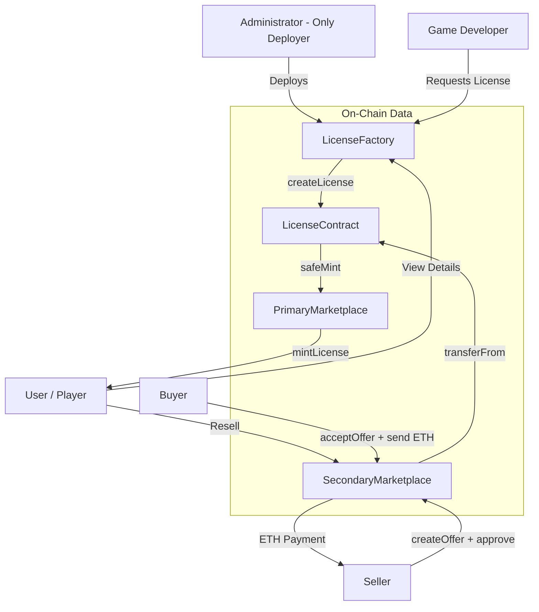

# Smart Contract Architecture and Workflow for EVM Contracts

## Overview

This document describes the smart contract architecture, workflows, roles, events, and data flow involved in the licensing system for game developers and gamers on our platform. The system enables:

* Game developers to create licenses.
* Users to mint and purchase licenses.
* Secondary trading of licenses for EVM Based contracts.
* On-chain metadata and fee management.

---

##  Architectural Components

| Contract               | Responsibility                                                                |
| ---------------------- | ----------------------------------------------------------------------------- |
| `LicenseContract`      | ERC721 contract that represents the actual game license NFT                   |
| `LicenseFactory`       | Central authority for creating and managing game licenses                     |
| `PrimaryMarketPlace`   | Allows gamers to mint licenses (buy from the game developer)                  |
| `SecondaryMarketPlace` | Allows license resale among users with ETH payments and transfer mechanics    |
| `Types.sol`            | Common types used across contracts, like `License` and `LicenseInput` structs |

---

##  Roles and Access Control

| Role                  | Capabilities                                  |
| --------------------- | --------------------------------------------- |
| Administrator         | Deploys and owns the LicenseFactory contract and has access and modification rights on Primary and Secondary marketplace contracts  |
| Game Developer        | Requests license creation, updates metadata   |
| Coordinator           | Authorized to create licenses via the factory |
| License Owner         | NFT holder; can approve transfers             |
| Secondary Marketplace | Handles ETH/NFT transfers in resale           |

---

##  LicenseContract

### Inherits

* `ERC721`
* `ERC721URIStorage`

### Key Features

* Only callable by: `LicenseFactory`
* Only `safeMint` and `tokenURI` exposed externally.
* Transfers restricted to marketplaces using `_beforeTokenTransfer`, Only primary and secondary marketplace contracts can perform transfers.

### Metadata

```json
{
  "name": "Game License",
  "description": "License for Game XYZ",
  "image": "ipfs://.../image.png",
  "external_url": "https://game.example.com"
}
```

> Stored via `_setTokenURI` using IPFS URL.

---

##  LicenseFactory

### Responsibilities

* Creates new `LicenseContract` per game request.
* Stores all license metadata on-chain:

  * Developer, Publisher, Platform addresses
  * Fee splits
  * Timestamp, name, symbol, status

### Functions

| Function                | Purpose                           |
| ----------------------- | --------------------------------- |
| `createLicense()`       | Deploys new license, saves config |
| `changeLicenseStatus()` | Activates/deactivates license     |
| `updateLicense()`       | Updates metadata URI via token ID |
| `getLicenseFromID()`    | Reads license config              |

### Storage

License data is stored in a `mapping(uint256 => License)`.

### Access Control

* Only administrator can deploy factory.
* Coordinators can trigger license creation.

---

##  PrimaryMarketPlace

### Responsibilities

* Allows gamers to mint a license NFT using:

  * `mintLicense()`

### Workflow

1. Calls `LicenseFactory.getLicenseFromID(licenseId)`
2. Calls `safeMint()` on LicenseContract with URI
3. Tracks each NFT using local `GameNFT` mapping
4. Emits `Mint()` event

### Events

```solidity
event Mint(address indexed to, address indexed licenseAddress, string uri, uint256 timestamp);
```

> Useful for indexing NFTs minted via the primary sale.

---

##  SecondaryMarketPlace

### Responsibilities

* Allows resale of licenses by original NFT holders.
* Ensures secure ETH + NFT transfer atomicity.

### Flow

1. Seller approves `secondaryMarketplace` on LicenseContract via `approve()` or `setApprovalForAll()`.
2. Seller creates an offer:

   ```solidity
   struct Offer {
     address seller;
     uint256 price;
     bool isActive;
   }
   ```
3. Buyer accepts offer by calling `acceptOffer()` with exact `msg.value`.

### ETH and NFT Flow

| Step          | Action                                     |
| ------------- | ------------------------------------------ |
| Buyer pays    | ETH → SecondaryMarketplace                 |
| Marketplace   | Transfers ETH → Seller, NFT → Buyer        |
| Offer Cleanup | Offer marked inactive (`isActive = false`) |

### Events

```solidity
event OfferCreated(...);
event OfferAccepted(...);
```

> Events enable indexers to track secondary sales and license changes.

---

##  Events Summary

| Contract             | Event                | Purpose                           |
| -------------------- | -------------------- | --------------------------------- |
| LicenseFactory       | `NewLicenseContract` | When a new license is created     |
| LicenseFactory       | `OwnerChanged`       | Owner changed                     |
| LicenseFactory       | `AddCoordinator`     | Coordinator added                 |
| PrimaryMarketPlace   | `Mint`               | NFT minted by user                |
| SecondaryMarketPlace | `OfferCreated`       | Offer listed                      |
| SecondaryMarketPlace | `OfferAccepted`      | Offer accepted, transfer complete |

---

##  Technical Highlights

### Transfer Control

LicenseContract overrides:

```solidity
function _beforeTokenTransfer(...) internal override {
  require(
    msg.sender == primary_marketplace || 
    msg.sender == secondary_marketplace,
    "Unauthorized"
  );
  ...
}
```

Ensures only authorized marketplaces can transfer tokens.

### Factory Pattern

* `LicenseFactory` is the only contract allowed to instantiate `LicenseContract`.
* Centralizes configuration, metadata, and access control.

---

##  Future Enhancements

| Feature                   | Description                                                      |
| ------------------------- | ---------------------------------------------------------------- |
| **Audit**                 | External security review                                         |
| **ETH Split Logic**       | On-chain ETH split to developer, publisher, platform             |
| **Upgradeable Contracts** | Use of proxy pattern (e.g., UUPS, Transparent) for upgradability |
| **Royalties**             | Optional ERC2981 integration for secondary sales                 |
| **Dynamic Metadata**      | Real-time metadata rendering                                     |

---

##  Flow diagram

### Contract Interaction Flow

---

##  Suggested File Structure

```
contracts/
├── LicenseContract.sol
├── LicenseFactory.sol
├── PrimaryMarketPlace.sol
├── SecondaryMarketPlace.sol
├── types/
│   └── Types.sol
├── interfaces/
│   ├── ILicenseContract.sol
│   ├── ILicenseFactory.sol
│   └── IPrimaryMarketPlace.sol
```