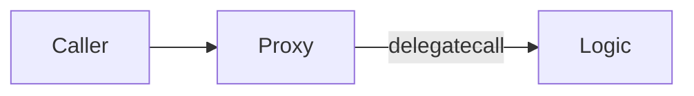
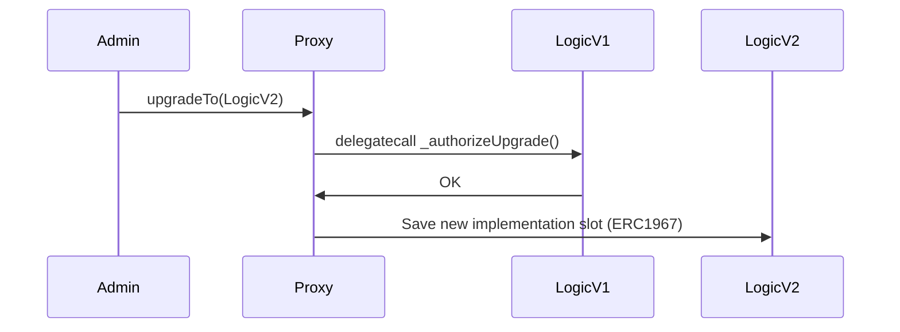

Here is a complete **in-depth markdown POC guide** for implementing **smart contract upgradeability** in Solidity using industry best practices, **with comparisons, architectural diagrams (Mermaid-compatible), pros and cons**, and a **UUPS-based upgradeable system tailored to your setup** (e.g., `LicenseFactory`, `LicenseContract`, `PrimaryMarketplace`, `SecondaryMarketplace`).

---

## Proof of Concept: Smart Contract Upgradeability with Proxies

---

### **Objective**

Implement upgradeability for your modular contract system using a **UUPS proxy pattern**, ensuring:

* Persistent proxy address
* Flexible upgradability of logic (LicenseFactory, etc.)
* Industry best practices (OpenZeppelin + EIP-1967/UUPS)
* Modular contracts with clear ownership and upgrade permissions

---

## Why Upgradeability?

In Ethereum:

* Contracts are **immutable**
* But business logic evolves (bugfixes, fees, roles, marketplaces, etc.)
* We want to **change logic** while **preserving storage and contract address**

---

## Upgradeability Options: Summary

| Method             | Description                              | Pros                             | Cons                            | Status          |
| ------------------ | ---------------------------------------- | -------------------------------- | ------------------------------- | --------------- |
| **Proxy (UUPS)**   | Logic in implementation, proxy owns data | Gas-efficient, clean, flexible   | Requires careful access control | ✅ Recommended   |
| Transparent Proxy  | Admin vs user context split              | Time-tested, widely used         | Slightly more overhead          | ✅ Common        |
| Beacon Proxy       | Multiple proxies share a single impl     | Good for multi-instance upgrades | More complex setup              | ⚠️ Niche        |
| Diamond (EIP-2535) | Modular function-based upgrades          | Highly flexible, modular         | Complex to reason/debug         | 🧪 Experimental |

> **UUPS** is preferred by OpenZeppelin for modern use.

---

## What We’ll Build

We’ll apply UUPS upgradeability to:

* `LicenseFactory` → upgradeable
* `LicenseContract` → regular logic contract created by factory
* `PrimaryMarketplace`, `SecondaryMarketplace` → regular logic

Only the **factory** needs to be upgradeable.

---

## UUPS Proxy Architecture

```mermaid
graph TD
  user(User)
  proxy(Proxy Contract)
  v1(Logic: LicenseFactory V1)
  v2(Logic: LicenseFactory V2)

  user --> proxy
  proxy --> v1

  click v1 "#"
  click v2 "#"

  classDef logic fill:#ffe0b2
  class v1,v2 logic

  subgraph Upgrade Flow
    upgradeCmd[upgradeTo(V2)]
    proxy -.-> upgradeCmd -.-> v2
    proxy --> v2
  end
```

---

## Code Structure

```
contracts/
│
├── LicenseFactory.sol          <-- upgradeable (UUPS)
├── LicenseFactoryV2.sol        <-- upgraded logic
├── LicenseContract.sol         <-- created from factory (not upgradeable)
├── PrimaryMarketplace.sol      <-- standalone contract
├── SecondaryMarketplace.sol    <-- standalone contract
```

---

## LicenseFactory (V1) - Upgradeable Version

```solidity
// SPDX-License-Identifier: MIT
pragma solidity ^0.8.20;

import "@openzeppelin/contracts-upgradeable/proxy/utils/UUPSUpgradeable.sol";
import "@openzeppelin/contracts-upgradeable/access/OwnableUpgradeable.sol";
import "@openzeppelin/contracts-upgradeable/proxy/utils/Initializable.sol";

contract LicenseFactory is Initializable, OwnableUpgradeable, UUPSUpgradeable {
    address public owner;
    
    function initialize(address _admin) public initializer {
        __Ownable_init();
        __UUPSUpgradeable_init();
        owner = _admin;
    }

    function _authorizeUpgrade(address newImplementation) internal override onlyOwner {}

    function version() public pure returns (string memory) {
        return "v1";
    }

    // Factory logic here...
}
```

---

## LicenseFactoryV2 (Upgraded Logic)

```solidity
// SPDX-License-Identifier: MIT
pragma solidity ^0.8.20;

import "./LicenseFactory.sol";

contract LicenseFactoryV2 is LicenseFactory {
    function version() public pure override returns (string memory) {
        return "v2";
    }

    // New methods or changes...
}
```

---

## Deployment Workflow (Using Hardhat or Remix)

### Step 1: Deploy `LicenseFactory` (V1 logic)

### Step 2: Deploy UUPS Proxy

Use `ERC1967Proxy` and pass encoded `initialize(...)` as calldata:

```bash
// ABI encoding for initialize(address)
web3.eth.abi.encodeFunctionCall({
  name: "initialize",
  type: "function",
  inputs: [{ type: "address", name: "_admin" }]
}, ["0xYourAddress"])
```

Use that calldata when deploying `ERC1967Proxy(logic, data)`

### Step 3: Interact With Proxy

Call `version()` via proxy — should return `"v1"`

### Step 4: Deploy `LicenseFactoryV2`

### Step 5: Call `upgradeTo(address of V2)` using proxy ABI

Call `version()` again — now returns `"v2"`

---

## Access Control Best Practices

* Use `OwnableUpgradeable`
* Only allow upgrade by `owner`
* Consider timelocks or multisigs for real deployments

---

## How UUPS Works Under the Hood

### Proxy Delegation Flow



* Storage lives in **proxy**
* Logic lives in **implementation**
* `delegatecall` runs code in logic but in context of proxy’s storage

---

### UUPS Upgrade Flow



---

## Pros and Cons of UUPS

| Pros                               | Cons                                     |
| ---------------------------------- | ---------------------------------------- |
| Gas-efficient                      | Misconfigured upgrade breaks proxy       |
| Single storage layout (proxy)      | Logic must have upgrade guard            |
| Clean delegation (just 1 proxy)    | Requires deeper understanding            |
| Industry standard via OpenZeppelin | Only logic contract can initiate upgrade |

---

## Testing Tips

* Use scripts to test:

  * Deployment
  * Proxy behavior
  * Upgrade to V2
  * Storage persistence
* Always check `version()` or test data to confirm upgrade

---

## Deliverables for Your Contracts

| Contract               | Upgradeable? | Notes               |
| ---------------------- | ------------ | ------------------- |
| `LicenseFactory`       | ✅ Yes        | via UUPS            |
| `LicenseFactoryV2`     | ✅ Yes        | extended            |
| `LicenseContract`      | ❌ No         | Deployed by factory |
| `PrimaryMarketplace`   | ❌ No         | Standalone          |
| `SecondaryMarketplace` | ❌ No         | Standalone          |

---

## Recommendation

Use **UUPS** with OpenZeppelin + `@openzeppelin/contracts-upgradeable`, and restrict `_authorizeUpgrade()` to `onlyOwner`.

---

## Final Notes

* UUPS = upgrade logic inside logic contract itself
* Only one proxy = minimal gas
* Uses standard ERC1967 storage layout
