# Smart Contract Upgradeability with UUPS Pattern

## Overview

### Objective

Implement a robust upgradeability system for smart contracts using the Universal Upgradeable Proxy Standard (UUPS) pattern, ensuring persistent proxy addresses, secure upgrade mechanisms, and maintainable code architecture.

### Problem Statement

Traditional smart contracts are immutable once deployed. Business requirements evolve, requiring:
- Bug fixes and security patches
- Feature enhancements
- Fee structure modifications
- Access control updates

### Solution

UUPS proxy pattern provides:
- Persistent contract addresses
- Upgradeable business logic
- Gas-efficient operations
- Secure upgrade authorization

## UUPS Architecture

### High-Level Architecture

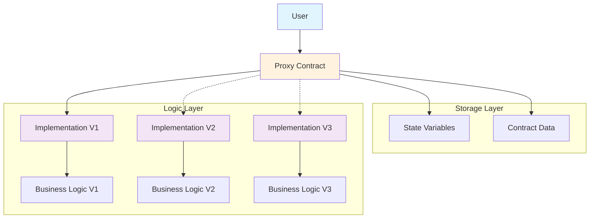

### Component Interaction

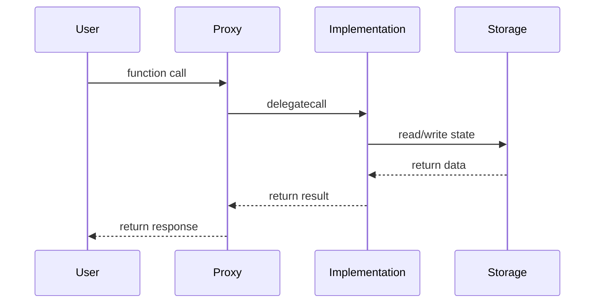

### Storage Layout

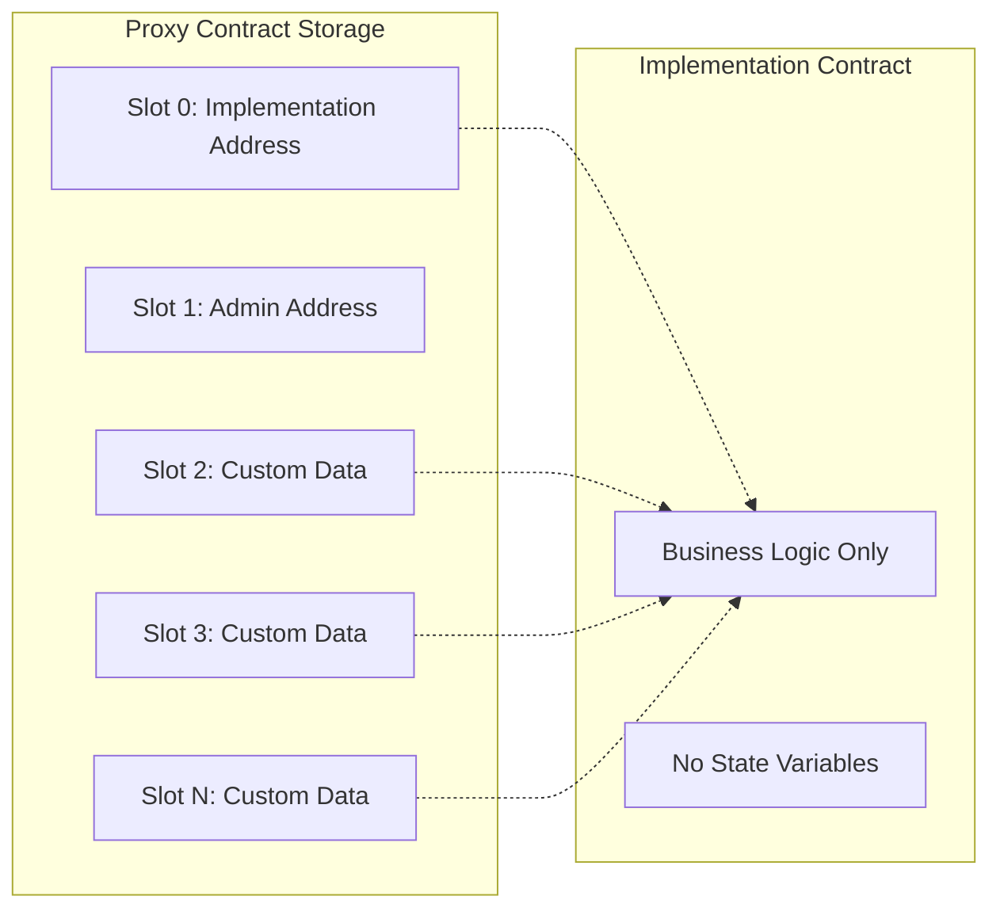

## Implementation Strategy

### Contract Hierarchy

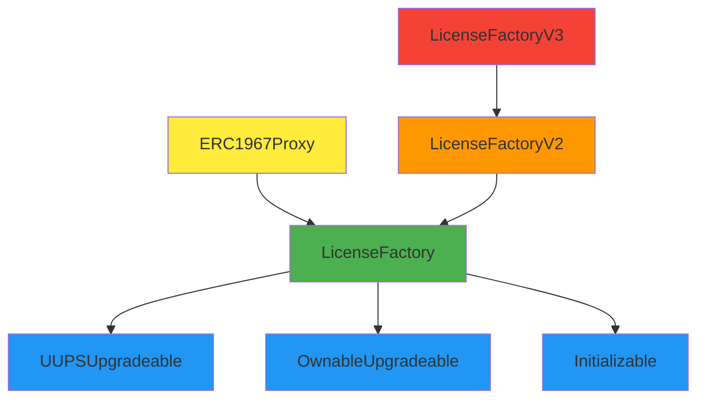

### Upgrade Process Flow

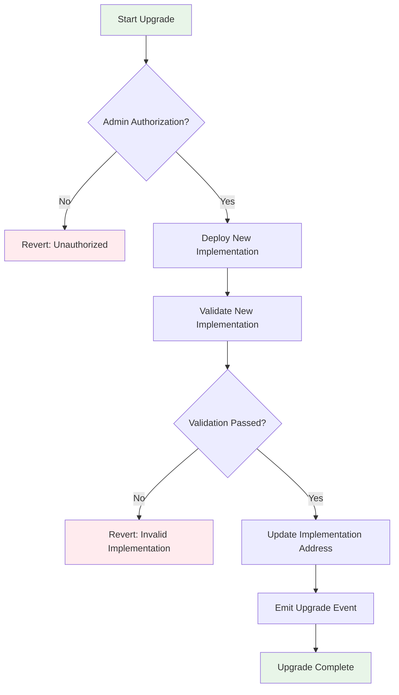

## Contract Design

### Base Upgradeable Contract

```solidity
// SPDX-License-Identifier: MIT
pragma solidity ^0.8.28;

import "@openzeppelin/contracts-upgradeable/proxy/utils/UUPSUpgradeable.sol";
import "@openzeppelin/contracts-upgradeable/access/OwnableUpgradeable.sol";
import "@openzeppelin/contracts-upgradeable/proxy/utils/Initializable.sol";

contract LicenseFactory is 
    Initializable, 
    UUPSUpgradeable, 
    OwnableUpgradeable 
{
    // State variables
    mapping(uint256 => License) public licenseContracts;
    address[] public allLicenses;
    uint256[] public tokenIds;
    mapping(address => bool) private coordinators;
    
    using Counters for Counters.Counter;
    Counters.Counter private _tokenIdCounter;
    
    // Storage gap for future variables
    uint256[45] private __gap;
    
    // Events
    event NewLicenseContract(address indexed contractAddress, uint256 tokenId);
    event ContractUpgraded(address indexed newImplementation);
    
    // Modifiers
    modifier onlyCoordinator() {
        require(coordinators[msg.sender], "Not a coordinator");
        _;
    }
    
    /// @custom:oz-upgrades-unsafe-allow constructor
    constructor() {
        _disableInitializers();
    }
    
    function initialize(address _admin) public initializer {
        __Ownable_init(_admin);
        __UUPSUpgradeable_init();
        coordinators[_admin] = true;
    }
    
    function _authorizeUpgrade(address newImplementation) 
        internal 
        override 
        onlyOwner 
    {
        emit ContractUpgraded(newImplementation);
    }
    
    function version() public pure virtual returns (string memory) {
        return "1.0.0";
    }
}
```

### Upgrade Implementation Example

```solidity
contract LicenseFactoryV2 is LicenseFactory {
    // New state variables (append only)
    uint256 public newFeature;
    mapping(address => uint256) public userMetrics;
    
    // Storage gap adjustment
    uint256[43] private __gap;
    
    function version() public pure override returns (string memory) {
        return "2.0.0";
    }
    
    function setNewFeature(uint256 _value) external onlyOwner {
        newFeature = _value;
    }
    
    function updateUserMetrics(address user, uint256 value) external onlyCoordinator {
        userMetrics[user] = value;
    }
}
```

## Deployment Workflow

### Initial Deployment Process

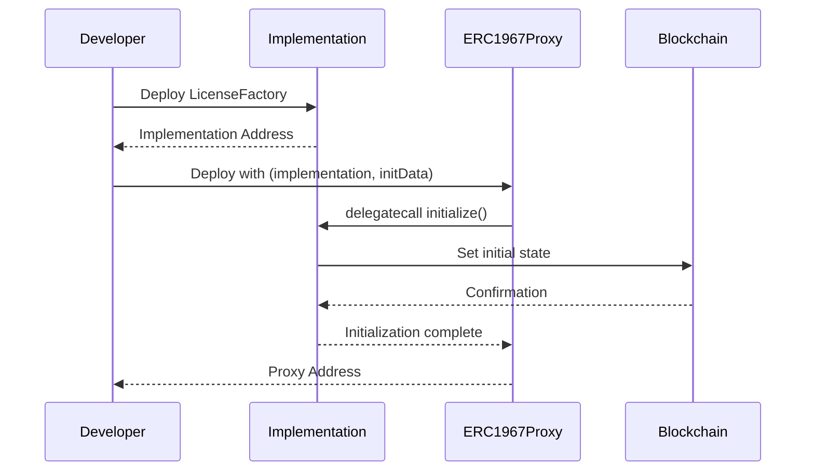

### Upgrade Process

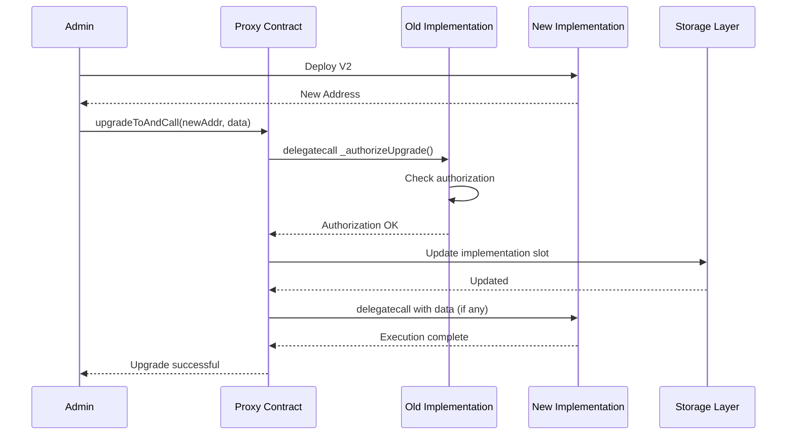

### State Migration Workflow

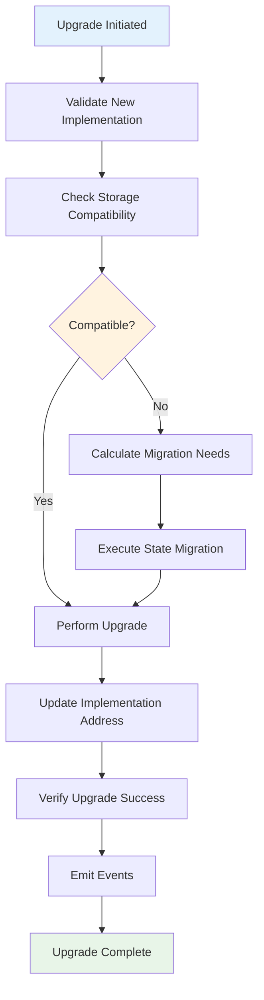

## Testing Framework

### Test Categories

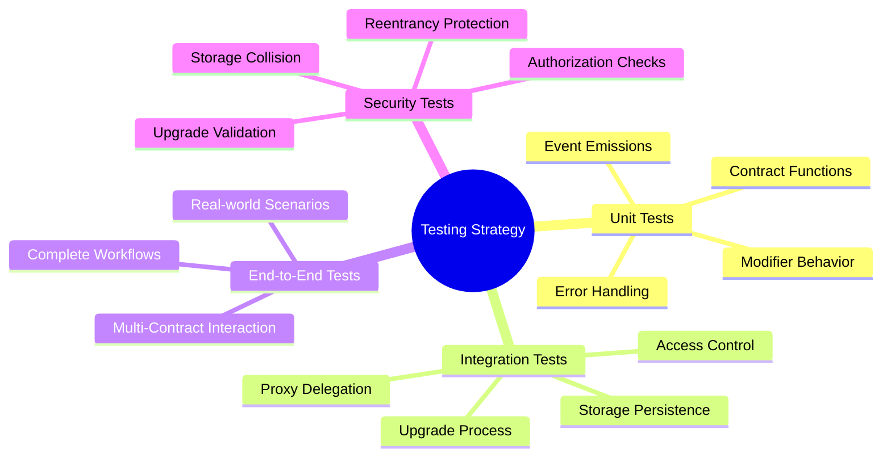

### Test Execution Flow

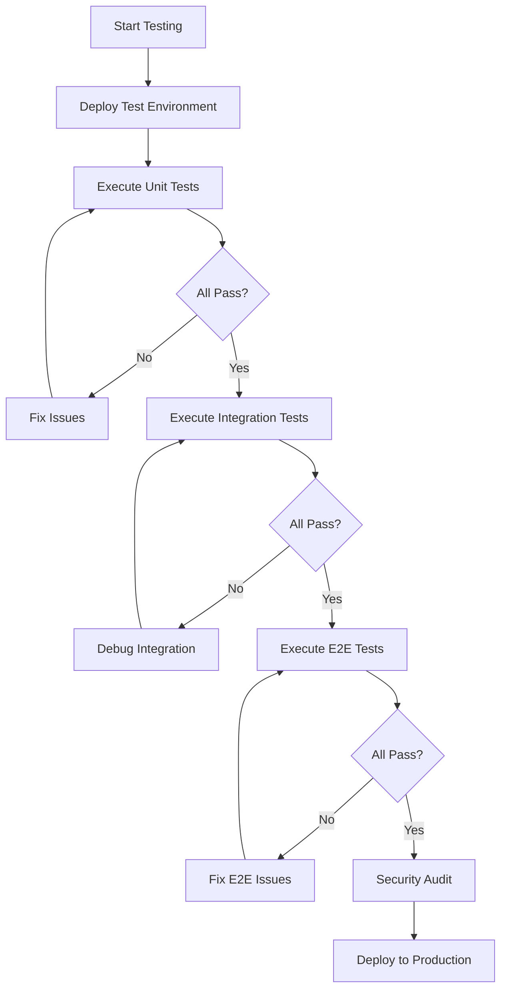

### Deployment Testing Checklist

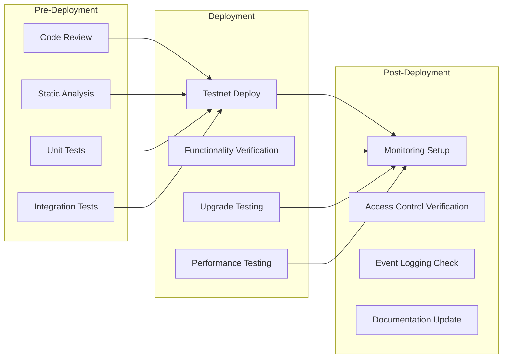

## Security Considerations

### Authorization Matrix

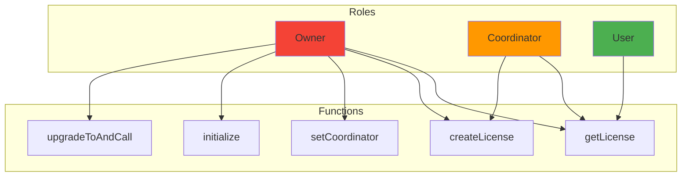

### Security Validation Process

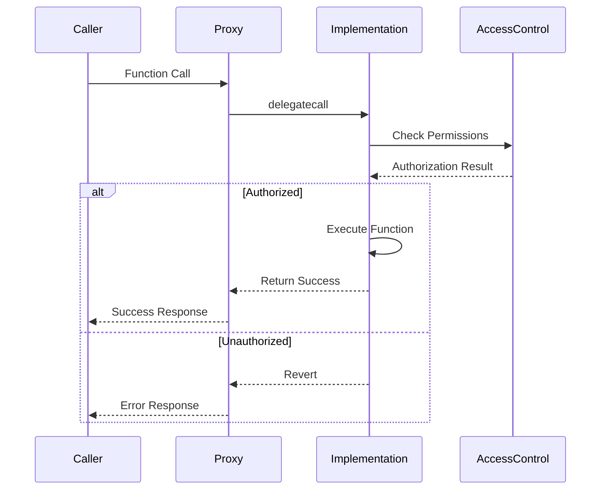

### Storage Collision Prevention

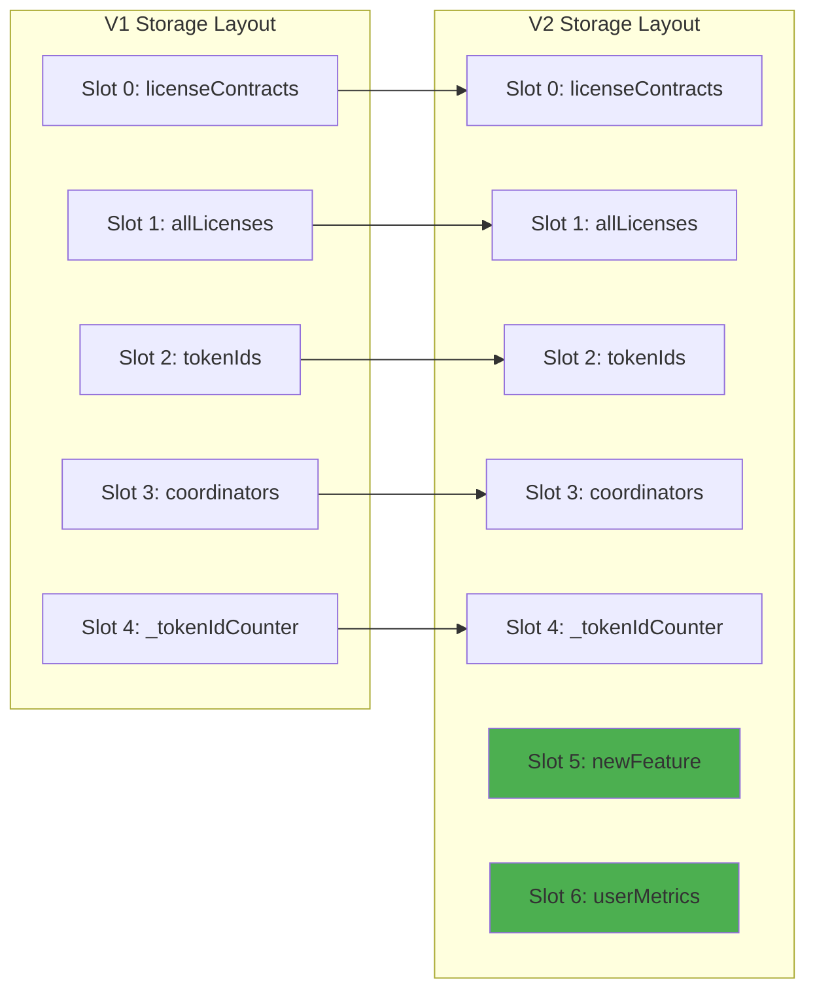

## Best Practices

### Development Guidelines

1. **Storage Layout Management**
   - Never reorder existing variables
   - Always append new variables
   - Use storage gaps for future expansion
   - Document storage layout changes

2. **Initialization Patterns**
   - Use `initializer` modifier for setup functions
   - Disable initializers in implementation constructor
   - Validate initialization parameters
   - Handle re-initialization scenarios

3. **Upgrade Authorization**
   - Implement strict access controls
   - Use multi-signature for critical upgrades
   - Add upgrade delay mechanisms
   - Log all upgrade events

4. **Version Management**
   - Implement version tracking
   - Document changes between versions
   - Maintain upgrade compatibility matrix
   - Test upgrade paths thoroughly

### Code Quality Standards

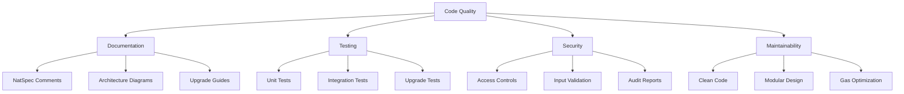

### Monitoring and Maintenance

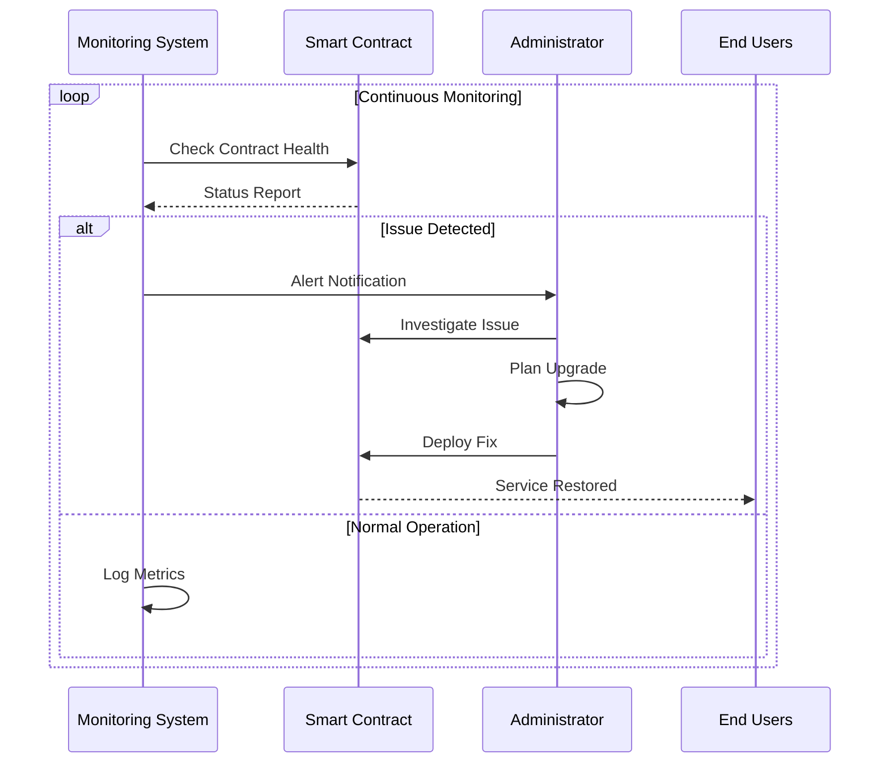

### Deployment Strategies

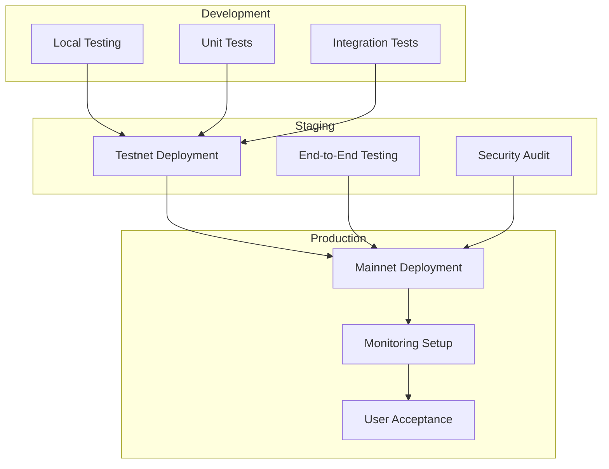